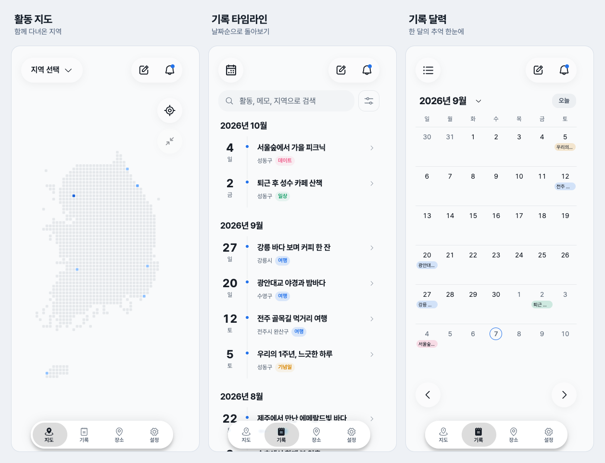
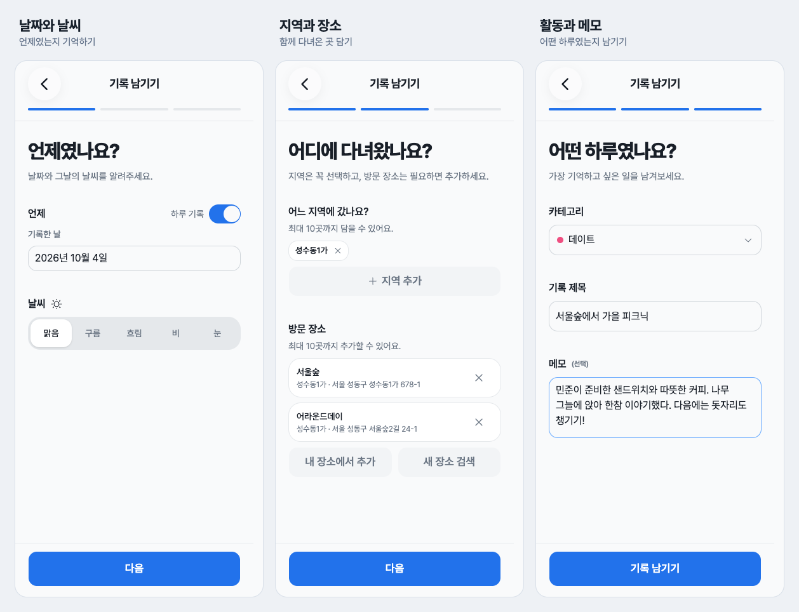
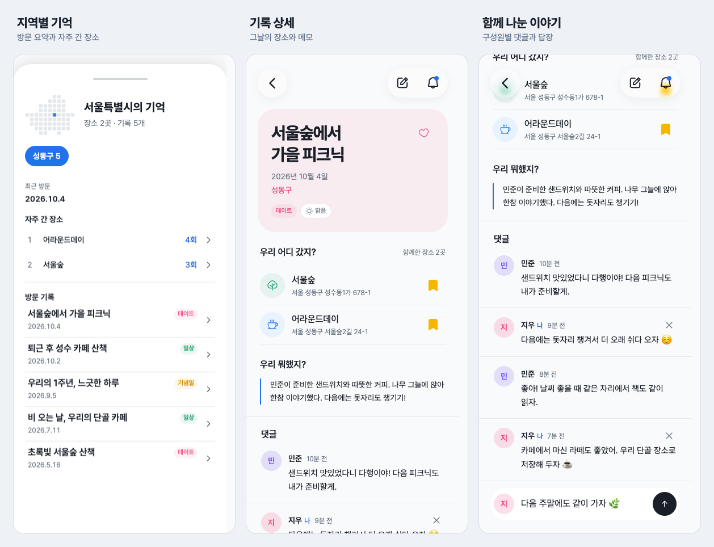
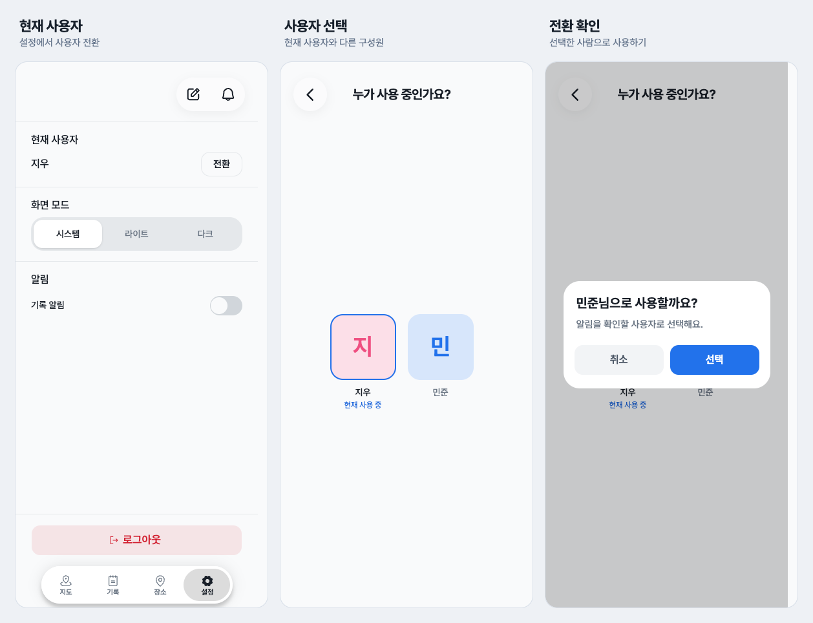
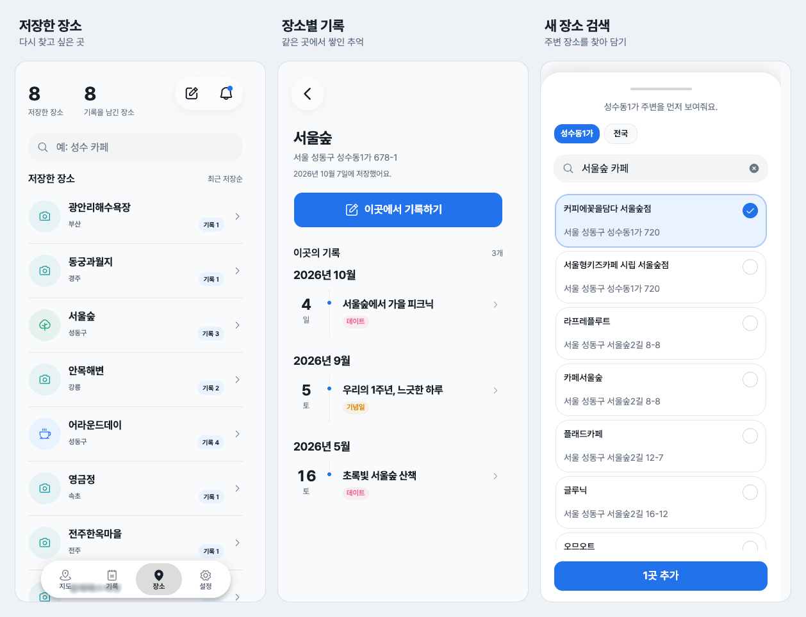

# 뭐했지?

**함께한 사람과 장소를 중심으로 우리의 하루를 기록합니다.**

뭐했지는 홈 화면에 설치해 앱처럼 사용하는 관계 기반 라이프로그 PWA(Progressive Web App)입니다.
연인이나 친구와 언제, 어디서, 무엇을 했는지 기록하고 대한민국 지도와 타임라인으로 돌아봅니다.
여행뿐 아니라 퇴근 후 산책, 단골 카페에서의 대화, 기념일처럼 함께한 일상도 모아 볼 수 있습니다.

## 홈 화면에 설치해서 사용하기

뭐했지는 브라우저에서 바로 사용할 수 있고 홈 화면에 설치하면 주소창 없이 독립된 앱 화면으로 실행됩니다.

- **iPhone**: Safari에서 서비스를 열고 공유 메뉴의 ‘홈 화면에 추가’를 선택합니다. [Apple 설치 안내](https://support.apple.com/ko-kr/guide/iphone/iph42ab2f3a7/ios)
- **Android·데스크톱**: 지원 브라우저의 ‘앱 설치’ 또는 ‘홈 화면에 추가’ 메뉴를 사용합니다. [브라우저별 설치 안내](https://developer.mozilla.org/en-US/docs/Web/Progressive_web_apps/Guides/Installing)
- **기록 알림**: 지원 환경에서 알림 권한을 허용하고 설정의 ‘기록 알림’을 켜면 새 기록의 웹 푸시를 받을 수 있습니다.

현재 기록 조회와 저장에는 인터넷 연결이 필요합니다.

## 주요 기능

- **함께 쓰는 기록**: 한 계정에 구성원을 등록하고 기기마다 현재 사용자를 선택합니다.
  구성원 이름으로 댓글을 남길 수 있습니다.
- **활동 지도**: 대한민국 셀 지도에 방문 지역을 표시하고 지역별 기록을 확인합니다.
  지도 확대·축소와 이동을 지원합니다.
- **타임라인과 달력**: 기록을 목록 또는 달력으로 보고 활동·메모·지역을 검색하거나 기간과 정렬 조건을 바꿉니다.
- **하루 기록하기**: 날짜 또는 기간, 방문 지역과 장소, 활동, 카테고리, 날씨, 메모를 남깁니다.
- **장소 모아 보기**: 카카오 장소 검색으로 방문 장소를 찾고 저장합니다.
  장소마다 연결된 기록을 다시 볼 수 있습니다.
- **사용 환경**: 라이트·다크 테마, PWA 설치, 새 기록 알림과 웹 푸시를 지원합니다.

## 실제 화면

로컬 앱을 모바일 화면 크기(390 x 844)로 실행해 캡처했습니다.
화면 속 구성원 ‘지우·민준’, 방문 날짜, 활동, 메모와 댓글은 README 촬영용 가상 데이터입니다.
장소 정보는 카카오 검색 결과를 사용했습니다.

핵심 사용 흐름을 합친 이미지 5개로 소개합니다.
각 이미지는 실제 화면 3장으로 구성되어 있으며 클릭하면 원본 크기로 볼 수 있습니다.
선택 시트와 관리 화면 등 추가 캡처는 아래 상세 목록에서 확인할 수 있습니다.

### 지도와 시간으로 돌아보기

대한민국 활동 지도에서 발자취를 보고 타임라인과 달력에서 함께한 날들을 다시 찾아봅니다.

[](docs/images/overview-flow.png)

### 기록 작성: 언제 → 어디서 → 무엇을

날짜와 날씨를 고르고 방문한 지역과 장소를 담은 뒤 카테고리·활동·메모를 입력합니다.

[](docs/images/record-create-flow.png)

### 그날의 이야기와 댓글

지역별 방문 요약에서 기록 상세로 이어집니다.
날짜·날씨·장소·메모를 돌아보고 구성원 이름으로 댓글을 주고받습니다.

[](docs/images/record-detail-flow.png)

### 이 기기의 사용자 전환하기

설정의 ‘전환’에서 구성원을 선택하고 확인 대화상자를 거쳐 현재 사용자를 바꿉니다.

[](docs/images/member-switch-flow.png)

### 장소에 쌓인 추억

저장한 장소마다 함께한 날들을 모아 봅니다.
기록 작성 중에는 카카오 검색으로 새 장소를 찾아 추가할 수 있습니다.

[](docs/images/place-flow.png)

<details>
<summary>추가 화면 보기 — 가입, 선택 시트, 수정·삭제, 설정</summary>

아래 링크를 누르면 각 흐름의 실제 화면 3장을 볼 수 있습니다.

- [회원가입 · 로그인 · 구성원 최초 설정](docs/images/auth-flow.png)
- [지역 검색 시트 · 저장 장소 선택 시트 · 작성 중 나가기 확인](docs/images/record-picker-flow.png)
- [기간·정렬 필터 시트 · 날짜별 기록 목록 시트 · 시트 안의 기록 상세](docs/images/record-browse-flow.png)
- [기록 관리 시트 · 기록 수정 화면 위·아래](docs/images/record-manage-flow.png)
- [새 장소 검색·저장 · 장소 관리 시트 · 장소 삭제 확인](docs/images/place-manage-flow.png)
- [다크 모드 설정 · 구성원별 알림 · 로그아웃 확인](docs/images/settings-flow.png)
- [기록 삭제 확인 · 댓글 삭제 확인 · 빈 검색 결과](docs/images/record-state-flow.png)

</details>

## 기술 스택

| 영역 | 사용 기술 |
| --- | --- |
| 웹 | Next.js App Router, React, TypeScript |
| 스타일·UI | Tailwind CSS, shadcn/ui, Base UI, Phosphor Icons |
| 서버 상태 | TanStack Query |
| 인증·데이터 | Supabase Auth, PostgreSQL, RLS |
| 장소·지역 검색 | Kakao Local API |
| 인터랙션 | Motion, use-funnel |
| PWA | Web App Manifest, Service Worker, Web Push |
| 도구 | pnpm, Biome, Node.js 내장 테스트 러너 |

## 로컬 실행

프로젝트의 패키지 관리자는 `pnpm@11.21.0`입니다.
해당 pnpm 버전을 지원하는 Node.js 환경과 Supabase 프로젝트, 카카오 REST API 키가 필요합니다.

```sh
pnpm install
```

루트에 `.env.local`을 만들고 연결할 프로젝트의 값을 입력합니다.

```dotenv
NEXT_PUBLIC_SUPABASE_URL=https://YOUR_PROJECT.supabase.co
NEXT_PUBLIC_SUPABASE_PUBLISHABLE_KEY=YOUR_PUBLISHABLE_KEY
KAKAO_REST_API_KEY=YOUR_KAKAO_REST_API_KEY
```

웹 푸시를 사용하려면 다음 값도 설정합니다.

```dotenv
NEXT_PUBLIC_VAPID_PUBLIC_KEY=YOUR_VAPID_PUBLIC_KEY
VAPID_PRIVATE_KEY=YOUR_VAPID_PRIVATE_KEY
VAPID_SUBJECT=mailto:YOUR_EMAIL
```

새 Supabase 프로젝트의 스키마 준비와 마이그레이션 절차는 [DB 마이그레이션 안내](supabase/README.md)를 따릅니다.
이메일 인증을 사용하는 경우 `http://localhost:3000/auth/confirm`을 Supabase의 허용 리디렉션 URL에 등록합니다.
다른 포트로 실행한다면 실제 실행 주소에 맞춰 등록합니다.

```sh
pnpm dev
```

[http://localhost:3000](http://localhost:3000)에서 회원가입합니다.
이메일 인증이 켜져 있다면 인증 메일의 링크로 가입을 완료한 뒤 구성원을 등록하면 기록을 시작할 수 있습니다.

## 프로젝트 구조

```text
app/             Next.js 라우팅과 route handler 진입점
src/app/         전역 스타일, provider, route handler 구현
src/pages/       페이지 단위 화면 조합
src/widgets/     지도, 기록 폼 등 화면 블록
src/features/    회원가입, 기록 생성, 장소 선택 등 사용자 행동
src/entities/    기록, 장소, 지역, 구성원 등 도메인
src/shared/      공용 UI, API 클라이언트, 유틸
supabase/        데이터베이스 마이그레이션
public/          PWA 아이콘, 서비스 워커 등 정적 파일
```

Feature-Sliced Design의 레이어별 의존 방향을 따릅니다.
상세 규칙은 [코드 컨벤션](docs/convention.md)에 정리되어 있습니다.

## 개발 문서

- [코드 컨벤션](docs/convention.md)
- [변경 범위별 검증 가이드](docs/verification.md)
- [DB 마이그레이션 안내](supabase/README.md)
- [추후 기능과 백로그](docs/future-features.md)
