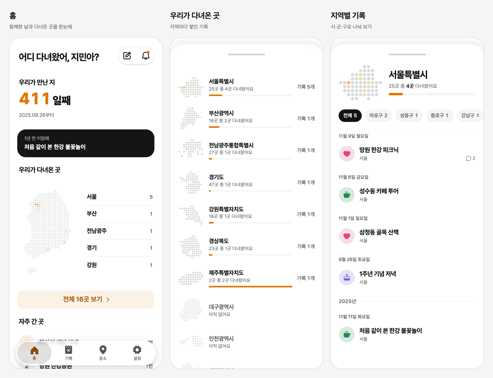
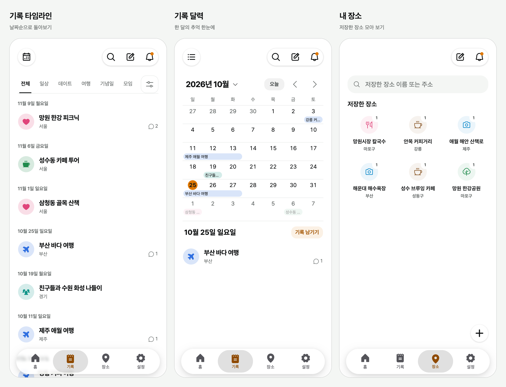
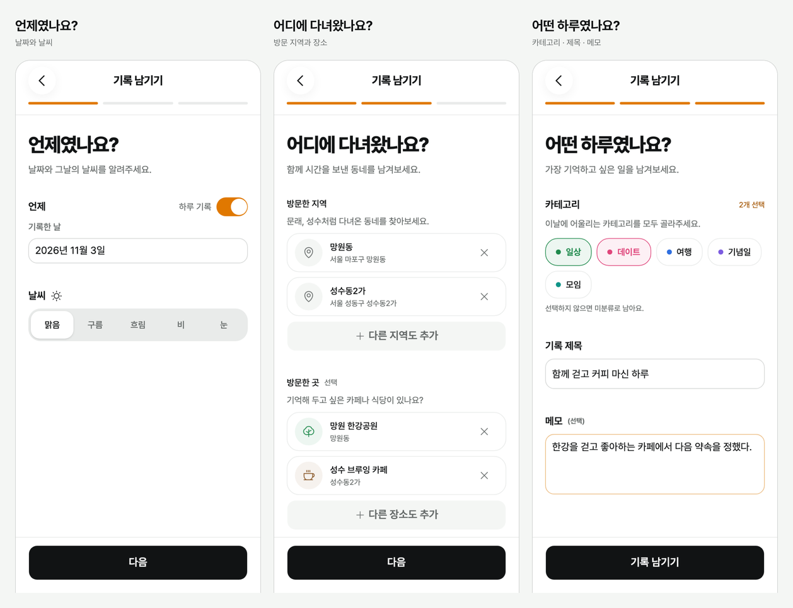
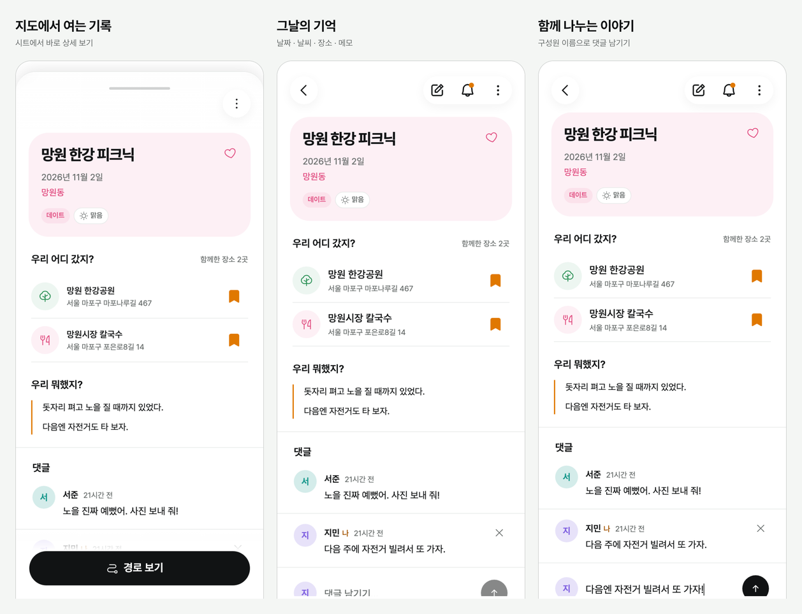

# 뭐했지?

**함께한 사람과 장소를 중심으로 우리의 하루를 기록해요.**

뭐했지는 홈 화면에 설치해 앱처럼 쓰는 관계 기반 라이프로그 PWA(Progressive Web App)예요.
연인이나 친구와 언제, 어디서, 무엇을 했는지 기록하고 홈 대시보드와 타임라인으로 돌아봐요.
여행뿐 아니라 퇴근 후 산책, 단골 카페에서의 대화, 기념일처럼 함께한 일상도 모아 볼 수 있어요.

가입 없이 [체험 데모](https://did-what.vercel.app/demo)에서 샘플 데이터로 주요 기능을 직접 써 볼 수 있어요.

## 홈 화면에 설치해서 사용하기

뭐했지는 브라우저에서 바로 쓸 수 있고, 홈 화면에 설치하면 주소창 없이 독립된 앱 화면으로 실행돼요.

- **iPhone**: Safari에서 서비스를 열고 공유 메뉴의 ‘홈 화면에 추가’를 선택해요. [Apple 설치 안내](https://support.apple.com/ko-kr/guide/iphone/iph42ab2f3a7/ios)
- **Android·데스크톱**: 지원 브라우저의 ‘앱 설치’ 또는 ‘홈 화면에 추가’ 메뉴를 사용해요. [브라우저별 설치 안내](https://developer.mozilla.org/en-US/docs/Web/Progressive_web_apps/Guides/Installing)
- **기록 알림**: 지원 환경에서 알림 권한을 허용하고 설정의 ‘기록 알림’을 켜면 새 기록·댓글 소식과 매일 오전 9시(한국 시간) 기록 알림을 받을 수 있어요.

기록을 보고 저장하려면 인터넷 연결이 필요해요.

## 주요 기능

- **함께 쓰는 기록**: 한 계정에 구성원을 등록하고 기기마다 현재 사용자를 골라 그 이름으로 기록과 댓글을 남겨요.
- **홈에서 돌아보기**: 우리가 만난 지 며칠째인지, 1년 전 이맘때의 기록, 다가오는 기념일, 자주 간 곳을 한 화면에서 봐요.
- **우리가 다녀온 곳**: 대한민국 점 지도에서 다녀온 곳이 기록이 많을수록 밝게 빛나고, 지역을 고르면 그곳의 기록을 시·군·구별로 모아 봐요.
- **타임라인과 달력**: 기록을 날짜순이나 월별로 돌아보고 검색·카테고리·기간으로 찾아요.
- **하루 기록하기**: 언제 → 어디서 → 무엇을 순서로 날짜·날씨, 방문 지역·장소, 카테고리·제목·메모를 남겨요.
- **댓글과 알림**: 기록마다 구성원 이름으로 댓글을 주고받고, 새 기록과 댓글 소식을 알림으로 받아요.
- **장소 모아 보기**: 저장한 장소와 그곳에 쌓인 기록을 모아 보고, 카카오 장소 검색으로 새 장소를 저장해요.
- **화면 모드**: 라이트·다크·시스템 모드를 지원해요.

## 실제 화면

모두 체험 데모에서 찍은 화면이고, 등장하는 사람과 기록은 가상 데이터예요.

### 홈에서 돌아보기

함께한 날과 다녀온 곳을 홈에서 한눈에 보고, 지역마다 쌓인 기록을 열어 봐요.

[](docs/images/home-flow.png)

### 시간과 장소로 찾아보기

타임라인과 달력에서 함께한 날들을 다시 찾고, 저장한 장소를 모아 봐요.

[](docs/images/records-flow.png)

### 기록 작성: 언제 → 어디서 → 무엇을

날짜와 날씨, 방문한 지역과 장소, 카테고리·제목·메모를 차례로 남겨요.

[](docs/images/record-create-flow.png)

### 그날의 이야기와 댓글

기록을 열어 그날의 장소와 이야기를 보고, 구성원 이름으로 댓글을 주고받아요.

[](docs/images/record-detail-flow.png)

## 기술 스택

| 영역 | 사용 기술 |
| --- | --- |
| 웹 | Next.js App Router, React, TypeScript |
| 스타일·UI | Tailwind CSS, shadcn/ui, Base UI, Phosphor Icons, React DayPicker |
| 서버 상태 | TanStack Query |
| 인증·데이터 | Supabase Auth, PostgreSQL, RLS |
| 장소·지역 검색 | Kakao Local API |
| 인터랙션 | Motion, use-funnel |
| PWA | Web App Manifest, Service Worker, Web Push |
| 도구 | pnpm, Biome, Node.js 내장 테스트 러너 |

## 프로젝트 구조

```text
app/             Next.js 라우팅과 route handler 진입점
src/app/         전역 스타일, provider, route handler 구현
src/pages/       페이지 단위 화면 조합
src/widgets/     하단 내비게이션, 기록 폼, 기록 상세 등 화면 블록
src/features/    회원가입, 기록 생성, 장소 선택 등 사용자 행동
src/entities/    기록, 장소, 지역, 구성원 등 도메인
src/shared/      공용 UI, API 클라이언트, 유틸
demo/            실제 앱 컴포넌트와 샘플 데이터를 연결하는 체험 데모
docs/            개발 문서, 기획과 백로그, README 스크린샷
supabase/        데이터베이스 마이그레이션
public/          PWA 아이콘, 서비스 워커 등 정적 파일
```

Feature-Sliced Design의 레이어별 의존 방향을 따르고, 상세 규칙은 [코드 컨벤션](docs/guides/convention.md)에 정리되어 있어요.

## 개발 문서

- [코드 컨벤션](docs/guides/convention.md)
- [변경 범위별 검증 가이드](docs/guides/verification.md)
